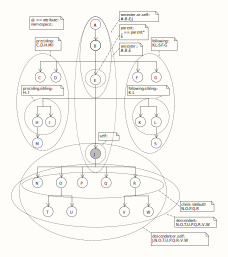

# Learning XSLT with Python

This repository is a playground for exploring XSLT, a powerful functional
language for data transformation, from within a modern Python environment. It
provides a declarative, "single-step" paradigm for tackling complex data
plumbing challenges in a way that is fundamentally different from traditional
imperative code.

Here you can learn and experiment with XSLT via the command line, using tools and examples for:

- Building and debugging XSLT stylesheets.
- Validating XML (primarily using lxml, as saxonche's validation requires a commercial license),
- Testing XPath 3.1 expressions.
- Connecting with key training resources (e.g., Michael Kay’s books).

The project leverages modern Python libraries like lxml (for XSLT 1.0) and
saxonche (for XSLT 3.0), which adds advanced features like streaming and native
JSON handling.

# Background: A Tale of Two Philosophies

The histories of Python and XSLT offer a compelling study in how technologies
are shaped. Python's development was famously practitioner-led by Guido van
Rossum, fostering a pragmatic culture that valued developer happiness. Its
evolution via the community-driven PEP process meant it was built by and for
programmers. In stark contrast, XSLT was born from a top-down W3C committee of
architects. The result was a language that was formally powerful but actively
hostile to the sensibilities of the average developer, burdened by a punishingly
verbose XML-based syntax and a steep, declarative-functional learning curve that
felt alien to most.

This difference had profound consequences and directly explains why XSLT fell
into mainstream obscurity. While Python's flexibility allowed it to find a
"killer app" by "borg'ing" the scientific world of MATLAB, XSLT's rigidity and
poor ergonomics actively repelled the fast-growing world of web development. As
web APIs moved towards the lightweight, brain-dead simple JSON format, XSLT's
heavyweight, document-centric model felt like using a sledgehammer to crack a
nut. While its champion, Michael Kay, was quietly perfecting it into a
masterpiece of engineering, the mainstream war had already been lost to tools
that were simply easier, faster, and more enjoyable to use.

Today, however, these two histories have converged. With the advent of libraries
like saxonche, XSLT has effectively "borg'd" itself into the Python ecosystem,
not as a competitor, but as a specialized engine for the kind of complex data
plumbing it was designed for. Freed from having to be a general-purpose tool,
its difficult nature is less of a barrier. It allows developers to use the right
tool for the job: Python for orchestration, and XSLT for the powerful, if
sometimes brutal, rule-based data transformations at which it remains unmatched.

## Quick Start

Clone the repo:

```bash
git clone https://github.com/aleph2c/learning_xslt_with_python.git
cd learning_xslt_with_python
pip install -e .
source venv/bin/activate
xslt install-compiler-errors  # installs Java version of sachonche
```

### Testing XPath Patterns

XSLT's power comes from XPath, which uses **axes** like ``child::``,
``parent::``, and ``ancestor::`` to navigate the XML tree. The diagram below
illustrates these relationships. You can experiment with them by running your
own XPath expressions against the corresponding /patterns/axis_testing.xml file,
which represents this exact tree structure.



To see the entire XML file, we could set the context to the "root" node then match
against everything in the document:

```bash
try -d patterns/ xpath -x"axis_testing.xml" -c"/" -p"*"
context: /
<A id="1">
  <B id="2">
    <C id="3"/>
    <D id="4"/>
    <E id="5">
      <H id="8">
        <M id="13"/>
      </H>
      <I id="9"/>
      <J id="10">
        <N id="14"/>
        <O id="15">
          <T id="20"/>
          <U id="21"/>
        </O>
        <P id="16"/>
        <Q id="17"/>
        <R id="18">
          <V id="22"/>
          <W id="23"/>
        </R>
      </J>
      <K id="11"/>
      <L id="12">
        <S id="19"/>
      </L>
    </E>
    <F id="6"/>
    <G id="7"/>
  </B>
</A>
```

Now let's set ``J`` as the node context and perform our first axis experiment:

```
try xpath -c "//J" -p "self::*/name()"
context: //J
J
```

Since the command is lazy, we can query from the ``J`` context without
re-specifying it and look back at ``J's`` ancestors like this:

```
try xpath -p "ancestor::*/name()"
context: //J
J
"A"
"B"
"E"
```

> **Note**
> If you are parsing an ``xhtml`` doc include the ``xhtml`` namespace prefix in your query:
> ``try -d oneal xpath -x example.html -c "/" -p "//xhtml:h1[1]"``

### Evaluating XSLT programs

To learn XSLT for transforming XML data, you can use this repository’s
command-line tools and XSLT compilers (installation instructions below). Suppose
you’re working through Chapter 7.4 of Sal Mangano’s XSLT Cookbook and have
transcribed the ``text-hierarchy.xsl`` example into
``sal/ch07/text-hierarchy.xsl``. You want to transform ``books.xml`` into
``text-hierarchy.txt`` using this XSLT program.

To do this:

- Set the working directory as ``sal/ch07``, and
- Use the ``text-hierarchy.xsl`` XSLT program to transform ``books.xml``.
- Pass an ``indent`` parameter (four space) to control output formatting
- Save the result to ``text-hierarchy.txt`` file.
- Display verbose output (``-v``) for debugging.

Run the following command:

```bash
try -d sal/ch07 ex \
  -x books.xml \
  -p saxon \
  -l text-hierarchy.xsl \
  --params "indent='    '" \
  -o text.hieracrhy.txt \
  -v
```

If you’re learning XSLT, you might make mistakes in ``text-hierarchy.xsl``. The
try command caches its inputs, so if you encounter compiler errors, you can edit
the XSLT file and re-run the transformation without retyping
the full command:

```bash
try ex -v
```

Repeat this cycle — edit ``text-hierarchy.xsl``, run try ex -v, and check errors
— until your XSLT program produces the desired ``text-hierarchy.txt`` output.

## Thinking in Trees: A New Paradigm for Python Developers

**XSLT is a powerful, declarative language for transforming complex data
structures.** While Python templating libraries like Jinja2 are excellent for
generating text from data, XSLT is a specialized tool designed for the
structural transformation of tree-like data such as XML and JSON.

The fundamental difference lies in its thinking model. Instead of writing
imperative Python code that loops through data, you write declarative XSLT
rules. You define what the output should look like for a given pattern, and the
XSLT processor, powered by the XPath query language, figures out how to apply
those rules across the entire document. This functional, rule-based approach can
be incredibly efficient for handling large or complex data streams.

Python supports XSLT through libraries like lxml, but this is limited to the
older, more basic XSLT 1.0 standard. This repository focuses on the modern XSLT
3.0 via the saxonche library, which provides full support for advanced features,
including native JSON handling.

Because this declarative, rule-based paradigm is so different from imperative
Python, learning it requires a new approach. This repository provides a complete
workflow to become fluent:

1. Build a custom AI "Professor" to act as your personal tutor.
2. Follow a "hack-to-learn" workflow using the provided code examples.
3. Use a curated curriculum based on classic XSLT texts.

### Build a Custom Professor

Copy the following markdown into a context file and feed it to the AI which is
training you. If you can't do that, just drop it into the AI's prompt.  This
will provide a short hand to turn it into an excellent tutor.

```markdown
# AI Interaction Modes for XSLT/XML Development

This document outlines custom interaction modes for consulting on XSLT, XML, and XPath. These modes allow for switching response styles dynamically by using a prefix at the start of a message (e.g., `TT:1 What is an atomic value?`).

To exit any mode and return to the default, adaptive response style, use the prefix `NN:` or explicitly ask to leave the current mode.

## Available Modes

### TT: Teacher Mode (Using Revised Bloom's Taxonomy)

*   **Purpose**: An educational style to help learn XSLT, XML, or XPath by building cognitive skills step-by-step. The mode focuses on one level of the taxonomy per query, providing prompts to evaluate and advance your understanding.
*   **Activation**: Prefix with `TT:X`, where `X` is the level from 1 to 6. If no level is specified (`TT:`), the mode will default to level 1 or infer from the context.
*   **Levels (Revised Bloom's Taxonomy)**:
    1.  **Remembering (TT:1)**: Recall facts and basic concepts. I'll ask questions like, "What is the difference between `xsl:copy` and `xsl:copy-of`?" or "What are the seven types of XML nodes?"
    2.  **Understanding (TT:2)**: Explain ideas or concepts. I'll ask for explanations like, "Can you describe what a sequence is in your own words?" or "Explain the purpose of the identity transform."
    3.  **Applying (TT:3)**: Use information in concrete situations. I'll provide scenarios like, "Show how you would use `xsl:for-each-group` to group these items by category."
    4.  **Analyzing (TT:4)**: Draw connections among ideas. I'll prompt analysis like, "Compare the built-in default templates to an explicit identity transform. What are the tradeoffs?"
    5.  **Evaluating (TT:5)**: Justify a stand or decision. I'll ask for critiques like, "Evaluate this template. Is there a more efficient or readable way to write it?"
    6.  **Creating (TT:6)**: Produce new or original work. I'll guide creation with prompts like, "Design a recursive function that traces the processing of a document."
*   **Exit**: Use `NN:` or say "Exit teacher mode."

### AA: XSLT Architect Mode

*   **Purpose**: High-level architectural and design discussions, focusing on best practices, patterns, and trade-offs without necessarily writing full code solutions. This mode is for exploring the "how" and "why" of a solution's structure.
*   **Activation**: Prefix with `AA:`. You can add a sub-focus like:
    *   `AA:patterns`: Discuss common XSLT design patterns (e.g., identity transform, fill-in-the-blanks).
    *   `AA:tradeoffs`: Analyze the pros and cons of different implementation choices (e.g., `xsl:for-each` vs. `xsl:apply-templates`).
    *   `AA:ideas`: Brainstorm multiple approaches to solving a complex transformation problem.
*   **Style**:
    *   Starts by restating the core problem to ensure understanding.
    *   Generates multiple potential solutions with clear pros and cons (e.g., performance, readability, maintainability).
    *   Includes risks or "gotchas" for each approach.
    *   Critiques user-provided ideas rigorously, pointing out potential flaws or edge cases and suggesting robust alternatives.
*   **Exit**: Use `NN:` or say "Exit architect mode."

### LH: Language Historian Mode

*   **Purpose**: An interdisciplinary discussion exploring the history, design philosophy, and evolution of XSLT/XML and related technologies. This mode focuses on the "why" behind the language's features and its place in the broader history of technology.
*   **Activation**: Prefix with `LH:`.
*   **Style**:
    *   Draws parallels and contrasts between XSLT's development and that of other languages (like Python).
    *   Explains the reasoning behind confusing or non-intuitive language features (e.g., XSLT's default templates).
    *   Discusses the influence of standards committees (W3C) versus individual or community-led language design.
    *   Analyzes the industrial and human factors that lead to a technology's adoption or decline.
*   **Exit**: Use `NN:` or say "Exit historian mode."

### NN: Normal Mode

*   **Purpose**: Reset to the standard, adaptive response style for direct questions and answers.
*   **Activation**: Prefix with `NN:` or occurs automatically after exiting another mode.
```

### Hack-to-Learn Workflow

While new XSLT books are rare, the classic texts contain timeless problems and
patterns. This repository provides the code for those exercises, allowing you to
master XSLT using a modern, AI-driven workflow.

The core learning loop is simple: use this repository's code as a foundation and
an AI assistant as your personal tutor. An effective workflow is:

1. **Find an Example**: Navigate to a chapter's code within this repository.
2. **Load the Context**: Copy and paste the source XML and the XSLT (``.xsl``) file into
   your AI session.
3. **Interrogate the Code**: Ask the AI to explain the stylesheet until you
   understand it. Use the AA: (Architect) and LH: (Language Historian) prompts
   to explore why the code is structured a certain way and the design philosophy
   behind it.
4. **Run the Example**: Execute the code using the try command-line helper provided
   by this repository to see it in action.
5. **Test Your Knowledge**: Ask the AI to quiz you. Use the TT: (Teacher) prompts to
   generate targeted questions at different cognitive levels.  (A fast and
   **painful** way to learn is to set the TT prompt well beyond your level of
   competence.  If it hurts you are doing it right.)

### Recommended Curriculum

Apply the learning workflow above to this curated training path. The directory names in parentheses correspond to the code in this repository.

*   **1. The Basics (`otegem`)**
    *   **Book:** *Teach Yourself XSLT in 21 Days* by Michiel van Otegem.
    *   **Focus:** Work through chapters 3-17 to build a strong foundation. Use the `try xpath` command to master XPath concepts, and build a personal snippet library as you go.

*   **2. Practical Labs (`sal`)**
    *   **Book:** *XSLT Cookbook* by Sal Mangano.
    *   **Focus:** These are practical, recipe-style examples. Use the AI to explain the core concept of each recipe before examining the solution. (Key chapters: 15, 6).

*   **3. Intermediate Concepts**
    *   **Book:** *Beginning XSLT 2.0* by Jeni Tennison.
    *   **Focus:** Use the AI to explain the high-level concepts from the chapter headings, then dive into the code examples provided in this repo to see them implemented.

*   **4. Advanced Design Patterns**
    *   **Book:** Michael Kay’s *XSLT 2.0 and XPath 2.0 Programmer's Reference*.
    *   **Focus:** Specifically Chapter 17: "Stylesheet Design Patterns." This is essential reading for writing professional, maintainable XSLT.

*   **5. Bridging to XSLT 3.0**
    *   Since there is no single XSLT 3.0 book, use a combination of these excellent resources:
        *   **Michael Kay's Book:** The book above covers much of the foundation needed for 3.0.
        *   **Online Examples:** [Martin Honnen’s XSLT 3.0 by Example blog](https://xslt-3-by-example.blogspot.com/) and his expert answers on [Stack Overflow](https://stackoverflow.com/users/252228/martin-honnen).
        *   **JSON Handling:** Michael Kay's paper, [*Transforming JSON using XSLT 3.0*](https://www.saxonica.com/papers/xmlprague-2016mhk.pdf). (Supporting code is in the `/patterns` folder of this repo.)
        *   **XPath 3.1 Training:** [Altova’s free training resources](https://www.altova.com/training/xpath3).

### Setting Up Your Development Enviroment

To make XSLT less verbose (a trade-off for its XML-based metaprogramming), use
editor snippets. In Vim/Neovim, SirVer’s UltiSnips is excellent—create your own
library as you learn. Build snippets while reading books, adding comments for
reference. Use UltiSnips’ shortcut to jump between your XSLT file and 
[snippet files](https://github.com/aleph2c/.vim/blob/master/snippets/xslt.snippets). Keep snippets under Git-control for portability.

With snippets, typing and debugging XSLT becomes faster. Experiment with [Evan
Lenz’s XSLT-visualizer](https://github.com/evanlenz/xslt-visualizer) to see how
templates react to XML input in an event-driven way.

### Shifting to Functional Thinking

XSLT is functional, so stop thinking procedurally (like in Python). Prototype in
Python first, but avoid overwriting variables—use recursion instead. This repo’s
try to-python command converts XML to Python code as a starting point.

Once your functional Python prototype works, use Grok/Gemini to translate it to
XSLT. The output won’t run perfectly, but it handles syntax hurdles. Combine it
with your XPath patterns (tested via try xpath, see below) and snippets to
refine. Use the repo’s try ex tool to compile and test until it works.

### Tools and Libraries

XSLT has been developed for 25 years, with Michael Kay (Saxonica) leading standards and tools. Saxonica’s open-source Saxon-HE supports XSLT 3.0; they sell licensed versions with extra features. Kay’s team is responsive on Stack Overflow and bug trackers.

In Python, install saxonche (12.8.0+, Mozilla license) for XSLT 3.0/XPath 3.1:

- Supports XSLT 3.0, XPath 3.1, XQuery 3.1, XSD 1.1 (schema validation disabled in free version).
- It’s a C port of Saxon Java, usable in Python via ctypes.

However, ``saxonche`` has limitations:

- Incomplete documentation and examples (see this repo's ``/oneal`` folder for
  working ones).
- Error messages are off by default -- wrap call in exceptions for recovery.
- For stability, use ``lxml`` for XSLT 1.0 (better documented, based on
  libxml2/libxslt)
  
To see compiler errors (essential for learning), use Java's Saxon-HE CLI:

```bash
java -jar saxon-he-12.0.jar -xsl:your.xsl -s:your.xml
```

This repo's CLI tools call Java for errors when ``saxonche`` detects issues.
Install Java to set up as below.

# Installation Instructions

In order for you get build a decent learning environment, setup:

- This repo's CLI
- Two XSLT pythone parser (``lxml/sachonche``)
- Example files

```bash
git clone git@github.com:aleph2c/leaning_xslt.git
cd learning_xslt
python3 -m venv venv
source ./venv/bin/activate
pip install --upgrade pip
pip install -e .
# see note:
xslt install-compile-errors

```

**Note:**
The ``saxonche`` pip package used by this repo will not output XSLT compiler errors,
but if you want to see them (which you do) this command will fix the problem:

```bash
xslt install-compiler-errors
```

This will download the
[zipped java version of saxon](https://github.com/Saxonica/Saxon-HE/blob/be4dd844d935d8d0ef09748490448624abe3c66b/12/source/saxon12-0source.zip)
and decompress its contents in ``./java/``.  With this jar installed the ``try``
cli tool will call out to java when the ``saxoniche`` library fails to compile
your ``.xsl``.  It will rerun the compilation using the jar and output the XSLT
compiler error messages to the terminal.  This will give you the feedback
required to debug your programs.

# Running Examples

The repo installs a ``try`` command.  To see how it works:

```text
try --help
Usage: try [OPTIONS] COMMAND [ARGS]...

    Try an XSLT/XPath example and cache the command

Options:
  -d, --dir TEXT  Set the exercise directory
  --help          Show this message and exit.

  Commands:
    cache  View your command cache
    ex     Run an exercise
    xpath  Test an XPath query on a given xml doc and context

```

## How to Run Specific Examples

To see how to run an exercise:

```text
try ex --help
Usage: try ex [OPTIONS]

  Run an exercise:
  
  try -d sal/ch07 ex \
    -x books.xml \
    -l text.hierarchy.xsl \
    -params "indent='    ',param2='some_value'" \
    -o text.hierarchy.txt

Options:
  -n, --node-name TEXT    Set the node name
  -x, --xml TEXT          Set the xml file
  -j, --json TEXT         Set the json file (saxon)
  -l, --xls TEXT          Set the xls file
  -p, --processor TEXT    Set the processor (lxml|saxon)
  -o, --output_file TEXT  Set the output file name
  --params TEXT           Set the optional parameter(s)
  -v, --verbose           Run in verbose mode?
  --help                  Show this message and exit.
```

To run an example:

```
try -d jenni/ch2_html_from_xml ex -x TVGuide2.xml -l TVGuide2.xsl -o TVGuide2.html -p lxml -v
# a lot of XML

ran the lxml process
```

To see your cache:

```
try cache
{'context': '', 'home_dir': 'jenni/home/scott/xslt/ch3_templates',
'output_file_name': 'TVGuide2.html', 'processor': 'lxml', 
'xls_file_name': 'TVGuide2.xsl', 'xml_file_name': 'TVGuide2.xml'}
```

To run the same exercise again:

```
try ex -v
# a lot of XML

ran the lxml processor
```

To try the same example with the saxon processor, you just have to tell the
``try`` command you want to use the ``saxon`` processor, if the other options
are not specified it will use your cached options:

```
try ex -p saxon -v
# a lot of XML

ran the saxon processor
```

## Running Your Own Examples

To run examples from a different book, add descriptives folder names and put
your xml and xsl files in these folders.  Use the ``-d`` flag to point to the
folder you are working with, then run the sub-commands as you did before.

## JSON Transform Example 1

In this example we will perform a transform to increase the price of a product
tagged with "ice" by 10 percent (see ./patterns/to_json.xs):

Given this input:

```
python -m json.tool ./michael/json_input.json

[
  {
    "id": 2,
    "name": "An ice sculpture",
    "price": 12.50,
    "tags": ["cold", "ice"],
    "dimensions": {
    "length": 7.0,
    "width": 12.0,
    "height": 9.5
    },
    "warehouseLocation": {
      "latitude": -78.75,
      "longitude": 20.4
    }
  },
  {
    "id": 3,
    "name": "A blue mouse",
    "price": 25.50,
    "dimensions": {
      "length": 3.1,
      "width": 1.0,
      "height": 1.0
    },
    "warehouseLocation": {
      "latitude": 54.4,
      "longitude": -32.7
    }
  }
]
```

Perform a transform (saxonpy works, saxonche stackoverflow):

```
# this will crash with saxonche 12.0 due to stackoverflow errors
# but will run with saxonche 12.1

try -d michael \
  ex -j json_input.json \
     -l to_json.xsl \
     -o json_output.json \
     -p saxon
```

This will create the following output:

```
python -m json.tool ./michael/json_output.json

[
    {
        "id": 2,
        "name": "An ice sculpture",
        "price": 13.75,
        "tags": [
            "cold",
            "ice"
        ],
        "dimensions": {
            "length": 7,
            "width": 12,
            "height": 9.5
        },
        "warehouseLocation": {
            "latitude": -78.75,
            "longitude": 20.4
        }
    },
    {
        "id": 3,
        "name": "A blue mouse",
        "price": 25.5,
        "dimensions": {
            "length": 3.1,
            "width": 1,
            "height": 1
        },
        "warehouseLocation": {
            "latitude": 54.4,
            "longitude": -32.7
        }
    }
]
```

## JSON Transform Example 2

We would like to invert the hierarchy of a json document. In this example we
will take the data being organized from faculty->courses->students->email and
transform it to email->courses.  We will also sort the output based on last name
and then the first name of each student, but we will keep the student's name out
of the final output.

Given this input:

```
[
  {
    "faculty": "humanities",
    "courses": [
      {
        "course": "English",
        "students": [
          {
            "first": "Mary",
            "last": "Smith",
            "email": "mary_smith@gmail.com"
          },
          {
            "first": "Ann",
            "last": "Jones",
            "email": "ann_jones@gmail.com"
          }
        ]
      },
      {
        "course": "History",
        "students": [
          {
            "first": "Ann",
            "last": "Jones",
            "email": "ann_jones@gmail.com"
          },
          {
            "first": "John",
            "last": "Taylor",
            "email": "john_taylor@gmail.com"
          }
        ]
      }
    ]
  },
  {
    "faculty": "science",
    "courses": [
      {
        "course": "Physics",
        "students": [
          {
            "first": "Anil",
            "last": "Singh",
            "email": "anil_singh@gmail.com"
          },
          {
            "first": "Amisha",
            "last": "Patel",
            "email": "amisha_patel@gmail.com"
          }
        ]
      },
      {
        "course": "Chemistry",
        "students": [
          {
            "first": "John",
            "last": "Taylor",
            "email": "john_taylor@gmail.com"
          },
          {
            "first": "Anil",
            "last": "Singh",
            "email": "anil_singh@gmail.com"
          }
        ]
      }
    ]
  }
]
```

Perform the transform (saxonpy works, saxonche stackoverflow):

```
try -d michael \
  ex -x json_input2.json \
     -l to_json2.xsl \
     -o json_output2.json \
     -p saxon

```

This will produce the following output

```

python -m json.tool ./patterns/json_output2.json

[
  {
    "email": "ann_jones@gmail.com",
    "courses": [
      "English",
      "History"
    ]
  },
  {
    "email": "amisha_patel@gmail.com",
    "courses": [
      "Physics"
    ]
  },
  {
    "email": "anil_singh@gmail.com",
    "courses": [
      "Physics",
      "Chemistry"
    ]
  },
  {
    "email": "mary_smith@gmail.com",
    "courses": [
      "English"
    ]
  },
  {
    "email": "john_taylor@gmail.com",
    "courses": [
      "History",
      "Chemistry"
    ]
  }
]
```

# Integrating XSLT 3.0 with Python in the main thread

The [saxonche documentation](https://pypi.org/project/saxonche/) is incomplete
and almost useless.  To see fixed versions of the low quality python examples
provided by Saxonica look in the ``oneal`` folder of this repo.

If you want to get your python code to parse XML/JSON/XSLT and output XML/JSON
using ``saxonche`` consider the following:

```python

from pathlib import Path
from saxonche import PySaxonProcessor

def transform_with_saxonche(
    self, home_dir, xml_file_name, xsl_file_name, output_file_name
):
    # Don't use the PySaxonProcess context manager if you are calling saxonche
    # over and over again within your program.  Instead build the proc and
    # xsltproc once, and reference them when you need them.  If you don't do
    # this, you will get strange memory errors:
    # "JNI_CreateJavaVM() failed with result: -5" (last seen in saxonc-he 11.4)
    #
    # Example of how to build the proc and xsltproc once per program invocation:
    #
    # from functools import cache as cached
    # @cached
    # def get_cached_procs_from(*args):
    #   proc = PySaxonProcessor(licence=False)
    #   xsltproc = proc.new_xslt30_processor()
    #   return proc, xsltproc
    #
    # def transform_with_saxonche(...)
    #   proc, xsltproc = get_cached_procs_from(PySaxonProcessor)
    #   # ...

    # If you are running your transforms once per program invocation
    # you can use the PySaxonProcessor context manager.  Don't be fooled, given
    # that this context manager doesn't clean up memory when it's done, it's not
    # really behaving like a Python context manager. (see the memory bug
    # mentioned above)
    with PySaxonProcessor(license=False) as proc:
        xsltproc = proc.new_xslt30_processor()
        xsltproc.set_cwd(str(home_dir))

        if not Path(home_dir).exists():
            print(f"{home_dir} doesn't exist")
            exit(1)

        if not (Path(home_dir) / xml_file_name).exists():
            print(
                f"xml_file_name: {str(Path(home_dir) / xml_file_name)} doesn't exist"
            )
            exit(1)

        if not (Path(home_dir) / xsl_file_name).exists():
            print(
                f"xsl_file_name: {str(Path(home_dir) / xsl_file_name)} doesn't exist"
            )
            exit(1)

        if Path(xml_file_name).suffix == ".json":
            json_input_param = proc.make_string_value(str(home_dir / xml_file_name))
            xsltproc.set_parameter("json_input_filename", json_input_param)

        stylesheet_file = str(Path(home_dir) / xsl_file_name)
        _exec = xsltproc.compile_stylesheet(
            stylesheet_file=stylesheet_file,
        )
        if _exec is None:
            print("saxonica failed")
            exit(1)

        if Path(xml_file_name).suffix == ".json":
            # it's a mystery why we have to use call_template_returning_file
            # and not make_string_value (this isn't documented anywhere)
            _exec.call_template_returning_file(output_file=output_file_name)
        else:
            # add a test_param to validate saxon is working
            test_param = proc.make_string_value(str(home_dir / xml_file_name))
            _exec.set_parameter("test_param", test_param)
            _exec.set_initial_match_selection(file_name=xml_file_name)
            _exec.apply_templates_returning_file(output_file=output_file_name)

        with open(home_dir / output_file_name, "r") as fp:
            contents = fp.read()
            print(contents)

```

# Integrating XSLT 3.0 with Multithreaded Python

```python
# This doesn't cause StackOverFlow crashes and, its fully documented 
# and its documentation isn't wrong.  It only support XSLT 1.0
import lxml
```

But if you are willing to accept some risk, here is a working demo of Python thread
performing XSLT transforms using saxonche without causing StackOverFlows:

```python
# working copy can be found in ./cli/thread_demo.py
import os
import shutil
from uuid import uuid1
from pathlib import Path

from queue import Queue
from threading import Thread
from threading import Lock
from collections import namedtuple
from threading import Event as ThreadEvent

from saxonche import PySaxonProcessor

proc_globals = {}
proc_globals_lock = Lock()
ValidateXmlPath = (Path(__file__).parent / "validate_xml.xsl").resolve()
SaxonPayload = namedtuple(
    "SaxonPayload",
    ["home_dir", "xml_file_name", "xsl_file_name", "output_file_name", "verbose"],
)

def __initialize_saxon(*args):
    """The PySaxonProcessor proc and the xslt30 proc should only be made once"""

    if "proc" in proc_globals:
        proc = proc_globals["proc"]
        xsltproc = proc_globals["xsltproc"]
    else:
        proc = PySaxonProcessor(license=False)
        xsltproc = proc.new_xslt30_processor()
        proc_globals["proc"] = proc
        proc_globals["xsltproc"] = xsltproc

    return proc, xsltproc

# call this from the main thread at least once
proc_globals_lock.acquire()
__initialize_saxon()
proc_globals_lock.release()


def __saxon_xslt30_transform(
    lock, home_dir, xml_file_name, xsl_file_name, output_file_name, verbose=False
):

    result = ""

    lock.acquire()
    proc, xsltproc = __initialize_saxon()

    home_path = Path(home_dir)
    xml_file_path = Path(home_dir) / xml_file_name
    xsl_file_path = Path(home_dir) / xsl_file_name
    output_file_path = Path(home_dir) / output_file_name

    if not home_path.exists():
        result = f"{home_dir} doesn't exist"
        lock.release()
        return result

    if not xml_file_path.exists():
        result = f"xml_file_name: {xml_file_path} doesn't exist"
        lock.release()
        return result

    if not (Path(home_dir) / xsl_file_name).exists():
        result = f"xsl_file_name: {xsl_file_path} doesn't exist"
        lock.release()
        return result

    stashed_output_file_path = None
    if xml_file_path == output_file_path:
        temp_output_path = Path(output_file_path).parent / (str(uuid1())[0:7] + ".tmp")
        stashed_output_file_path = output_file_path
        output_file_path = temp_output_path

    if Path(xml_file_name).suffix == ".json":
        json_input_param = proc.make_string_value(str(home_dir / xml_file_name))
        xsltproc.set_parameter("json_input_filename", json_input_param)

    _exec = xsltproc.compile_stylesheet(stylesheet_file=str(xsl_file_path))
    if _exec is None:
        error = f"{xsltproc.error_message}"
        xsltproc.exception_clear()
        lock.release()
        raise RuntimeError(error)

    if Path(xml_file_name).suffix == ".json":
        # it's a mystery why we have to use call_template_returning_file
        # and not make_string_value (this isn't documented anywhere)
        _exec.call_template_returning_file(output_file=str(output_file_path))
        if stashed_output_file_path:
            shutil.copy(src=output_file_path, dst=stashed_output_file_path)
            os.remove(output_file_path)
            output_file_path = stashed_output_file_path
        del _exec
    else:
        # add a test_param to validate saxon is working
        test_param = proc.make_string_value(str(xml_file_path))
        _exec.set_parameter("test_param", test_param)
        _exec.set_initial_match_selection(file_name=str(xml_file_path))
        _exec.apply_templates_returning_file(output_file=str(output_file_path))
        if _exec.exception_occurred:
            saxon_error = f"{_exec.error_message}"
            _exec.exception_clear()
            lock.release()
            raise RuntimeError(saxon_error)

        if stashed_output_file_path:
            shutil.copy(src=output_file_path, dst=stashed_output_file_path)
            os.remove(output_file_path)
            output_file_path = stashed_output_file_path

        # if our output path is an .xml file, run a post-transform-test to see
        # if the provided xsl_file_name created valid xml
        if output_file_path.suffix == '.xml':
            xsl_post_test_path = ValidateXmlPath

            if not (xsl_post_test_path).exists():
                result = f"xsl_file_name:\n{xsl_post_test_path}\ndoesn't exist"
                lock.release()
                return result

            _exec = xsltproc.compile_stylesheet(stylesheet_file=str(xsl_post_test_path))

            _exec.transform_to_string(
                source_file=str(output_file_path),
            )
            if _exec.exception_occurred:
                saxon_error = f"{_exec.error_message}"
                _exec.exception_clear()
                lock.release()
                raise RuntimeError(saxon_error)
            del _exec

    if verbose:
        with open(home_dir / output_file_name, "r") as fp:
            result = fp.read()
    lock.release()
    return result

def thread_runner(lock, task_event, input_queue, output_queue):

    # this will cause the StackOverFlow if it isn't first called
    # in the main thread
    lock.acquire()
    __initialize_saxon()
    lock.release()

    while task_event.is_set():
        q = input_queue.get(block=True)
        input_queue.task_done()
        result = __saxon_xslt30_transform(
            lock,
            home_dir=q.home_dir,
            xml_file_name=q.xml_file_name,
            xsl_file_name=q.xsl_file_name,
            output_file_name=q.output_file_name,
            verbose=q.verbose,
        )
        output_queue.put(result)

# this function demontrates how to create a thread, communicate with it and stop it.
def saxon_xslt30_transform(
    home_dir, xml_file_name, xsl_file_name, output_file_name, verbose=False
):
    global proc_globals_lock

    input_queue = Queue()
    output_queue = Queue()

    payload = SaxonPayload(
        home_dir=home_dir,
        xml_file_name=xml_file_name,
        xsl_file_name=xsl_file_name,
        output_file_name=output_file_name,
        verbose=verbose,
    )

    # The task event is a flag, which when:
    # - set: means the thread should run
    # - cleared: means the thread should stop and exit
    task_event = ThreadEvent()
    task_event.set()

    thread = Thread(
        target=thread_runner,
        args=(proc_globals_lock, task_event, input_queue, output_queue),
        daemon=True,
    )
    # start the thread
    thread.start()
    # give something to the thread
    input_queue.put(payload)
    # wait for the thread to react
    input_queue.join()
    # wait for the thread's output
    result = output_queue.get(block=True)
    output_queue.task_done()

    # kill the thread
    task_event.clear()

    return result

if __name__ == '__main__':

    # adjust this to point to the directory containing you files
    home_dir = (Path(__file__).parent / ".." / "ch3_templates").resolve()
    xml_file_name = "HelloWorld.xml"
    xsl_file_name = "HelloWorld.xsl"
    output_file_name = "HelloWorld.html"

    result = saxon_xslt30_transform(
        home_dir, xml_file_name, xsl_file_name, output_file_name, verbose=True
    )
    print(result)

```

# Testing XPath

Here we run an XPath expression against the ``menu.xml`` file in the
``otegem/ch03`` directory, then cache the command:

```
try -d ./otegem/ch03 xpath -x menus.xml -c "/" -p "menu"
context: /
<menu>
  <appetizers title="Work up an Appetite">
    <dish id="1" price="8.95">Crab Cakes</dish>
    <dish id="2" price="9.95">Jumbo Prawns</dish>
    <dish id="3" price="10.95">Smoked Salmon and Avocado Quesadilla</dish>
    <dish id="4" price="6.95">Caesar Salad</dish>
  </appetizers>
  <entrees title="Chow Time!">
    <dish id="5" price="19.95">Grilled Salmon</dish>
    <dish id="6" price="17.95">Seafood Pasta</dish>
    <dish id="7" price="16.95">Linguini al Pesto</dish>
    <dish id="8" price="18.95">Rack of Lamb</dish>
    <dish id="9" price="16.95">Ribs and Wings</dish>
  </entrees>
  <desserts title="To Top It Off">
    <dish id="10" price="6.95">Dame Blanche</dish>
    <dish id="11" price="5.95">Chocolate Mousse</dish>
    <dish id="12" price="6.95">Banana Split</dish>
  </desserts>
</menu>
```

To run the next xpath query against the same file:

```
try xpath -p "(//dish)[6]"
context: /
<dish id="6" price="17.95">Seafood Past</dish>

try xpath -c "/" -p "/menu/entrees/*/text()"
context: /
Grilled Salmon
Seafood Pasta
Linguini al Pestro
Rack of Lamb
Ribs and Wings

```

You would use the context to simulate how a template matching an XPath pattern
would behave.  Suppose you were trying to see what line 12 of the following
would output:

```
 1  <?xml version="1.0" encoding="UTF-8"?>
 2  <xsl:stylesheet version="1.0"
 3   xmlns:xsl="http://www.w3.org/1999/XSL/Transform">
 4    <xsl: tempate match="/">
 5      <xsl:apply-templates />
 6    </xsl:template>
 7    <xsl: tempate match="/menu/entrees">
 8      Entrees:
 9      <xsl:apply-templates />
10    </xsl:template>
11    <xsl:template match="dish">
12      <xsl:value-of select="text" />
13    </xsl:template>
13  </xsl:stylesheet>
```

We could simulate what would be expressed at line 12 by setting the context to
``/menu/entrees``:

```
try xpath -v
3.1

try xpath -c "/menu/entrees" -p "dish/text()[1]"
context: /menu/entrees
Grilled Salmon
```

# Testing XPath Axis Features

This picture will help you understand how the axis feature works in XPath:


This is how the above picture can be represented in XML (see ``patterns/axis_testing.xml``):

```
try -d patterns/ xpath -x"axis_testing.xml" -c"/" -p"*"
context: /
<A id="1">
  <B id="2">
    <C id="3"/>
    <D id="4"/>
    <E id="5">
      <H id="8">
        <M id="13"/>
      </H>
      <I id="9"/>
      <J id="10">
        <N id="14"/>
        <O id="15">
          <T id="20"/>
          <U id="21"/>
        </O>
        <P id="16"/>
        <Q id="17"/>
        <R id="18">
          <V id="22"/>
          <W id="23"/>
        </R>
      </J>
      <K id="11"/>
      <L id="12">
        <S id="19"/>
      </L>
    </E>
    <F id="6"/>
    <G id="7"/>
  </B>
</A>
```

Now let's set ``J`` as the node context and perform our first axis experiment:

```
try xpath -c "//J" -p "self::*/name()"
context: //J
J
```

Let's look to see how the ``following::`` axis works, we search the "following" axis for any node name (``*``) 
and return the matched node names:

```
try xpath -p "following::*/name()"
"K"
"L"
"S"
"F"
"G"

try xpath -p "(following::* union preceding::*)/name()"
"C"
"D"
"H"
"M"
"I"
"K"
"L"
"S"
"F"
"G"
```

> **Note**
> If you are parsing an ``xhtml`` doc include the ``xhtml`` namespace prefix in your query:
> ``try -d oneal xpath -x example.html -c "/" -p "//xhtml:h1[1]"``

# Prototyping your XSLT/XPATH code in Python

The ``try to-python`` writes boilerplate code for you.  You would use this
command to:

- convert an XML file into a python dict within a minimal python program
- extend this generated python program with recursive expressions to solve your
  problem. (like an XSLT program would solve your problem)
- debug this python program using python tools
- place the working recursive python program into ChatGPT to discover XSLT syntax that will
  do the same thing
- use the recursive styled python, and the broken ChatGPT examples as a set of
  mental blueprints for how to write your XSLT program.
- write out your XSLT referencing these examples
- debug your XSLT until it works.

```
try -d patterns to-python -x axis_testing.xml -o axis_testing.py -v
# some python code written to the terminal
```

This command will output this python program:

```python

import pprint
def pp(item):
    pprint.pprint(item)

A = {
    "A": {
        "@id" :"1",
        "B": {
            "@id" :"2",
            "C": {
                "@id" :"3",
            },
            "D": {
                "@id" :"4",
            },
            "E": {
                "@id" :"5",
                "H": {
                    "@id" :"8",
                    "M": {
                        "@id" :"13",
                    },
                },
                "I": {
                    "@id" :"9",
                },
                "J": {
                    "@id" :"10",
                    "N": {
                        "@id" :"14",
                    },
                    "O": {
                        "@id" :"15",
                        "T": {
                            "@id" :"20",
                        },
                        "U": {
                            "@id" :"21",
                        },
                    },
                    "P": {
                        "@id" :"16",
                    },
                    "Q": {
                        "@id" :"17",
                    },
                    "R": {
                        "@id" :"18",
                        "V": {
                            "@id" :"22",
                        },
                        "W": {
                            "@id" :"23",
                        },
                    },
                },
                "K": {
                    "@id" :"11",
                },
                "L": {
                    "@id" :"12",
                    "S": {
                        "@id" :"19",
                    },
                },
            },
            "F": {
                "@id" :"6",
            },
            "G": {
                "@id" :"7",
            },
        },
    },
}

if __name__ == '__main__':
    pp(A)

```

If you run this program you will see this in your terminal:

```
python ./patterns/axis_testing.py
{'A': {'@id': '1',
       'B': {'@id': '2',
             'C': {'@id': '3'},
             'D': {'@id': '4'},
             'E': {'@id': '5',
                   'H': {'@id': '8', 'M': {'@id': '13'}},
                   'I': {'@id': '9'},
                   'J': {'@id': '10',
                         'N': {'@id': '14'},
                         'O': {'@id': '15',
                               'T': {'@id': '20'},
                               'U': {'@id': '21'}},
                         'P': {'@id': '16'},
                         'Q': {'@id': '17'},
                         'R': {'@id': '18',
                               'V': {'@id': '22'},
                               'W': {'@id': '23'}}},
                   'K': {'@id': '11'},
                   'L': {'@id': '12', 'S': {'@id': '19'}}},
             'F': {'@id': '6'},
             'G': {'@id': '7'}}}}
```

# Useful links

- [Broken python examples from Saxonica](https://www.saxonica.com/saxon-c/documentation12/index.html#!samples/samples_python)
- [interview with Michael Kay](https://www.youtube.com/watch?v=2Zt9oJtFKGw)
- [XPath 3.0/3.1 training resource](https://www.altova.com/training/xpath3),
- [XSLT-visualizer](https://github.com/evanlenz/xslt-visualizer)
- [XSLT 3.0 Prague 2016 resources](https://github.com/Saxonica/Prague2016)
- [XSLT XPath Tutorial by arbitrarytechnology](https://www.youtube.com/watch?v=WggVR4YI5oI)
- [Saxon XSLT 3.0 JSON Whitepaper](https://www.saxonica.com/papers/xmlprague-2016mhk.pdf)
- [What's new in XSLT 3.0 and XPath 3.1](http://dh.obdurodon.org/xslt3.xhtml)
- [xidel: Xidel is a command line tool to download and extract data from HTML/XML pages as well as JSON APIs](https://www.videlibri.de/xidel.html)
- [XML/XSLT links on Digital humanities](http://dh.obdurodon.org/)
- [XSLT elements](https://www.saxonica.com/documentation12/#!xsl-elements)
- [Martin Honnen's Understanding how to use maps](https://stackoverflow.com/a/48051099)
- [Martin Honnen's XSLT 3.0 by example blog](https://xslt-3-by-example.blogspot.com/)
- [Martin Honnen's XSLT github gists](https://gist.github.com/martin-honnen)
- [XSL 3.0 Specification](https://www.w3.org/TR/xslt-30)
- [A Roadmap to XML Parsers in Python](https://realpython.com/python-xml-parser/)
- [xmlschema python package](https://pypi.org/project/xmlschema/)
